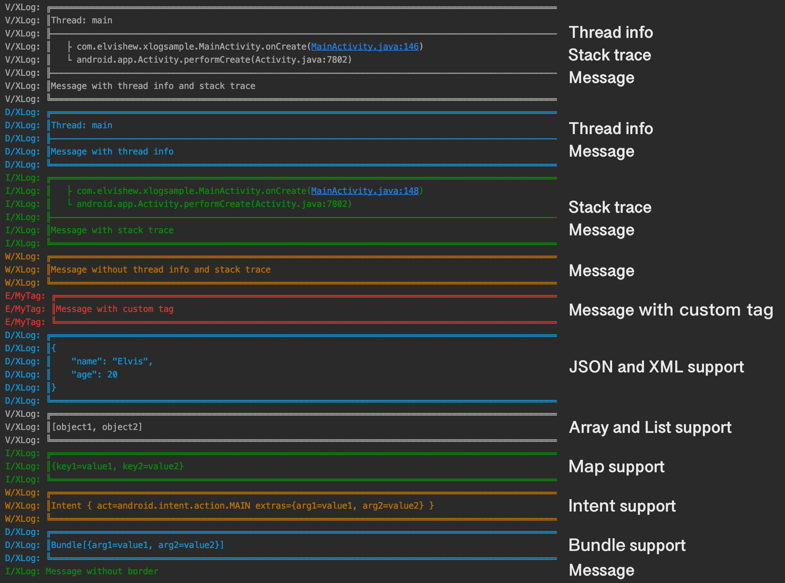

# XLog
声明：借鉴和使用了 [XLog](https://github.com/elvishew/xLog/) 的思想和部分代码，使用 Kotlin 重写、修改和优化，并且添加了更多功能。

轻量、美观强大、可扩展的 Android 和 Java 日志库，可同时将日志打印在如 Logcat、Console 和文件中。如果你愿意，你可以将日志打印到任何地方。

## Logcat 输出

## 快速开始

依赖

```groovy
implementation 'io.github.gregge:xlog:0.0.3'
```

打印日志

```kotlin
XLog.d("你好 xlog");
```

## 打印日志

打印简单消息。

```kotlin
XLog.d(message);
```

打印带 `throwable` 的消息，通常用于有异常被抛出时。

```kotlin
XLog.e(message, throwable);
```

支持格式化字符串，这样你就不需要去使用 `+` 拼接一大串的字符串和变量。

```kotlin
XLog.d("你好%s，我今年 %d 岁", "Elvis", 20);
```

未格式化的 JSON 和 XML 字符串会被自动格式化。

```kotlin
XLog.json(JSON_CONTENT);
XLog.xml(XML_CONTENT);
```

支持所有的 `Collection` 和 `Map` 类型的数据。

```kotlin
XLog.d(array);
XLog.d(list);
XLog.d(map);
```

如需要，你也可以直接打印 `Intent` 和 `Bundle` 对象。

```kotlin
XLog.d(intent);
XLog.d(bundle);
```

事实上，你可以打印任何类型的对象。你甚至可以为不同类型指定不同的 `ObjectFormatter`，如不指定，在对象转换为字符串时，会直接调用对象类型的 `toString()`。

```kotlin
XLog.d(object);
```

注意：以上内容中的 `v/d/i/w/e` 是可以相互替换的，`v` 表示 `VERBOSE`，`d` 表示 `DEBUG`，`i` for `INFO`，`w` 表示 `WARNING`，`e` 表示 `ERROR`。

## 配置

`xLog` 具有高度可扩展性，几乎任何一个组件都是可配置的。

当初始化时，可以用最简单的方式，

```kotlin
XLog.init(LogLevel.ALL);
```

也可以用高级的方式。

```kotlin
val config = XLog.createNewConfig()
    .setLogLevel(                                       // 指定日志级别，低于该级别的日志将不会被打印，默认为 LogLevel.ALL
        if (BuildConfig.DEBUG) {
            LogLevel.ALL
        } else {
            LogLevel.WARN
        }
    )
    .setTag("MY_TAG")                                    // 指定 TAG，默认为 "XLog"
    .enableThreadInfo()                                  // 允许打印线程信息，默认禁止
    .enableStackTrace(2)                                 // 允许打印深度为 2 的调用栈信息，默认禁止
    .enableBorder()                                      // 允许打印日志边框，默认禁止
    .jsonFormatter(YourJsonFormatter())                  // 指定 JSON 格式化器，默认为 DefaultJsonFormatter
    .xmlFormatter(YourXmlFormatter())                    // 指定 XML 格式化器，默认为 DefaultXmlFormatter
    .throwableFormatter(YourThrowableFormatter())        // 指定可抛出异常格式化器，默认为 DefaultThrowableFormatter
    .threadFormatter(YourThreadFormatter())              // 指定线程信息格式化器，默认为 DefaultThreadFormatter
    .stackTraceFormatter(YourStackTraceFormatter())      // 指定调用栈信息格式化器，默认为 DefaultStackTraceFormatter
    .borderFormatter(YourBoardFormatter())               // 指定边框格式化器，默认为 DefaultBorderFormatter
    .addObjectFormatter(AnyClass.class,                  // 为指定类型添加对象格式化器
            YourAnyClassObjectFormatter()                // 默认使用 Object.toString()
    )               
    .addInterceptor(
        BlacklistTagsFilterInterceptor(                  // 添加黑名单 TAG 过滤器
            "blacklist1", "blacklist2", "blacklist3"
        )
    )
    .addInterceptor(YourInterceptor())                   // 添加一个日志拦截器
val androidPrinter = AndroidPrinter(true);               // 通过 android.util.Log 打印日志的打印器
val consolePrinter = ConsolePrinter();                   // 通过 System.out 打印日志到控制台的打印器
val filePrinter = FilePrinter                            // 打印日志到文件的打印器
    .Builder("<日志目录全路径>")                           // 指定保存日志文件的路径
    .fileNameGenerator(DateFileNameGenerator())          // 指定日志文件名生成器，默认为 ChangelessFileNameGenerator("log")
    .backupStrategy(NeverBackupStrategy())               // 指定日志文件备份策略，默认为 FileSizeBackupStrategy(1024 * 1024)
    .cleanStrategy(FileLastModifiedCleanStrategy(MAX_TIME))     // 指定日志文件清除策略，默认为 NeverCleanStrategy()
    .flattener(MyFlattener())                            // 指定日志平铺器，默认为 DefaultFlattener
    .writer(MyWriter())                                  // 指定日志写入器，默认为 SimpleWriter
    .build()
XLog.init(                                               // 初始化 XLog
    config,                                              // 指定日志配置，如果不指定，会默认使用 new LogConfiguration.Builder().build()
    androidPrinter,     // 添加任意多的打印器。如果没有添加任何打印器，会默认使用 AndroidPrinter(Android)/ConsolePrinter(java)
    consolePrinter
)
```

初始化后，一个拥有全局配置的全局 `Logger` 将被创建，所有对 `XLog` 的打印函数的调用都会被传递到这个全局 `Logger` 来进行打印。

另外，你可以创建不限个数的、不同配置的 `Logger`：

* 基于全局 `Logger`将 TAG 改为 `"TAG-A"`。

```kotlin
val logger = logger.cloneConfig {  
    setTag("TAG-A")
    // 其他配置
}
logger.d("定制了 TAG 的消息");
// logger.updateConfig 更新配置，使用原 Logger 实例
// logger.cloneConfig  克隆配置，创建新 Logger 实例
// logger.newConfig    初始化新配置，默认继承 tag 和 level，创建新 Logger 实例
```

* 使用全局 `Logger`，允许打印日志边框和线程信息。

```kotlin
val logger = XLog.updateConfig {
    enableBorder()
    enableThreadInfo()
    ... // 其他配置的覆盖
}
logger.d("带有线程信息和日志边框的消息");
```

你还可以使用一次性配置来打印日志。

```kotlin
XLog.tag("TAG-A").d("定制了 TAG 的消息");  // 临时tag，一次使用后失效

XLog.dynamicTag = true;  // 开启动态tag，每次调用都会生成新的 tag
XLog.dynamicTag {   // 动态tag，作用域内有效
    d("定制了 TAG 的消息");
}

// 新建Logger 实例
XLog.newConfig {
    enableBorder().enableThreadInfo()
}.d("带有线程信息和日志边框的消息");
```

## 打印到任何地方

只需一句调用

```kotlin
XLog.d("你好 xlog");
```
你就可以将 `"你好 xlog"` 打印到

* Logcat（使用 `AndroidPrinter`）

* 文件（使用 `FilePrinter`）

以及任何你想打印到的其他地方。

打印到其他地方，你只需自己实现个 `Printer` 接口，并在初始化过程中指定它

```kotlin
XLog.init(config, printer1, printer2...printerN);
```

或者在创建非全局 `Logger` 时指定它

```kotlin
val logger = XLog.newConfig {
    printers(printer1, printer2...printerN)
}

val logger = XLog.createNewLogger().apply {
    printers(printer1, printer2...printerN)
 }
```

## 保存日志到文件

要保存日志到文件，你需要创建一个 `FilePrinter`

```kotlin
val filePrinter: Printer = FilePrinter.Builder("<日志目录全路径>") // 指定保存日志文件的路径
    .fileNameGenerator(DateFileNameGenerator()) // 指定日志文件名生成器，默认为 ChangelessFileNameGenerator("log")
    .backupStrategy(NeverBackupStrategy()) // 指定日志文件备份策略，默认为 FileSizeBackupStrategy(1024 * 1024)
    .cleanStrategy(FileLastModifiedCleanStrategy(MAX_TIME)) // 指定日志文件清除策略，默认为 NeverCleanStrategy()
    .flattener(MyFlattener()) // 指定日志平铺器，默认为 DefaultFlattener
    .build()
```

并在初始化时添加它

```kotlin
XLog.init(config, filePrinter);
```

或者在创建非全局 `Logger` 时添加它

```kotlin
val logger = XLog.newConfig {
    printers(filePrinter)
}
```

### 自定义日志文件名

你可以直接指定一个文件名，也可以根据一些规则将日志保存到不同文件中。

* 使用 `ChangelessFileNameGenerator`，你可以指定一个不变的文件名。

```
日志目录
└──log
```

* 使用 `LevelFileNameGenerator`，根据级别将日志保存到不同文件中。

```
日志目录
├──VERBOSE
├──DEBUG
├──INFO
├──WARN
└──ERROR
```

* 使用 `DateFileNameGenerator`，根据日期将日志保存到不同文件中。

```
日志目录
├──2020-01-01
├──2020-01-02
├──2020-01-03
└──2020-01-04
```

* 直接实现一个 `FileNameGenerator`，根据自定义的文件名生成规则来保存日志。

```
日志目录
├──2020-01-01-<hash1>.log
├──2020-01-01-<hash2>.log
├──2020-01-03-<hash>.log
└──2020-01-05-<hash>.log
```

默认情况下，会使用 `ChangelessFileNameGenerator` 将日志保存到一个名叫 `log` 的文件中。

### 自定义日志格式

各日志元素（日期，时间，日志级别和消息） 在被保存到日志文件前，需要被“平铺”成一个单独的字符串，你可以使用 `Flattener` 来做这件事。

我们已经定义了一个 `PatternFlattener`，足以满足你的大部分需求。你所需要做的只是，传入一个带参的 `pattern`。

支持的参数：

|参数|含义|
|:---:|---|
|{d}|日期时间。使用默认的日期时间格式 "yyyy-MM-dd HH:mm:ss.SSS"|
|{d format}|日期时间。使用自定义的日期时间格式|
|{l}|日志级别的缩写。例如：V/D/I|
|{L}|日志级别的全称。例如：VERBOSE/DEBUG/INFO|
|{t}|日志的 TAG|
|{m}|日志的消息|

想象有这么一个日志，级别为 `DEBUG`，TAG 为 `"my_tag"`，消息为 `"简单消息"`，使用不同的 `pattern`，平铺后的日志为：

|Pattern|平铺后的日志|
|:---:|---|
|{d} {l}/{t}: {m}|2016-11-30 13:00:00.000 D/my_tag: 简单消息|
|{d yyyy-MM-dd HH:mm:ss.SSS} {l}/{t}: {m}|2016-11-30 13:00:00.000 D/my_tag: 简单消息|
|{d yyyy/MM/dd HH:mm:ss} {l}\|{t}: {m}|2016/11/30 13:00:00 D\|my_tag: 简单消息|
|{d yy/MM/dd HH:mm:ss} {l}\|{t}: {m}|16/11/30 13:00:00 D\|my_tag: 简单消息|
|{d MM/dd HH:mm} {l}-{t}-{m}|11/30 13:00 D-my_tag-简单消息|

如果你不想自己指定所谓的 `pattern`，可以使用 `ClassicFlattener`。它实际上是一个使用 `{d} {l}/{t}: {m}` `pattern` 的 `PatternFlattener`。

默认情况下，`FilePrinter` 会使用 `DefaultFlattener`，这个平铺器只会简单地将时间戳和消息连接起来，你应该不会喜欢它，所以你得记得自己指定 `Flattener`，推荐使用 `ClassicFlattener`。

### 自动备份

随着时间推移，日志文件可能会变得很大，大到我们不希望的程度。使用 `AbstractBackupStrategy2` 可以帮助我们在特定条件下创建一个全新的同名日志文件，并继续写入，而旧日志文件会被加上 `.bak.n`（n 是备份序号）的文件名后缀。以上过程即为“日志备份”

```
日志目录
├──log
├──log.bak.1
├──log.bak.2
├──log.bak.3
├──...
└──log.bak.n
```

如果你不喜欢 `.bak.n` 后缀，你可以直接使用 `BackupStrategy2` 指定备份文件名。

大部分时候，你只是想在日志文件达到一定大小时，触发备份。 `FileSizeBackupStrategy2` 刚好可以满足这个要求。

默认情况下，`xLog` 会使用 `FileSizeBackupStrategy(1024*1024)`，在日志文件大小达到 1M 时触发备份，且同时最多只会有一个正在写入的文件，以及一个备份文件，这意味着你最多只能保存 2M 的日志。

所以，如果你想要保存更多的日志，以及允许更多的备份数量（而不仅仅是默认的一个），请使用 `FileSizeBackupStrategy2`，它允许多个备份文件同时存在。

### 自动清理

如果你使用会生成可变名字的 `FileNameGenerator`，那日志文件夹里就很可能会有不止一个日志，并且可能会越来越多。此外，如果你还使用了不限数量的备份策略，那也可能会让日志数量失控。为了防止占满磁盘，你需要一个 `CleanStrategy`。

通常，你可以使用 `FileLastModifiedCleanStrategy`，它会在初始化期间自动删掉那些一段时间（如：一周）以来都未被修改的日志文件。

默认情况下，会使用 `NeverCleanStrategy`，它不会做任何自动清理的工作。

### 压缩日志文件

仅需调用

```kotlin
LogUtil.compress("<日志目录全路径>", "<要保存的压缩文件全路径>");
```

一个 zip 文件将会被创建，整个日志文件夹都将被压缩并被写入其中，这样你可以轻松收集到用户日志用于问题调试。

注意：原始的日志文件不会被删除。

## 拦截和过滤日志

使用 `Interceptor`，在每条日志被打印之前，你都会有一个机会去修改或过滤掉该日志。

你可以使用一些预定义的 `Interceptor`，比如 `WhitelistTagsFilterInterceptor` 只允许带特定 TAG 的日志被打印，`BlacklistTagsFilterInterceptor` 被用来过滤掉带特定 TAG 的日志。

你可以为单个 `Logger` 指定多个 `Interceptor`，这些 `Interceptor` 将会按被添加的顺序依次获得修改或过滤掉日志的机会。当一条日志被某 `Interceptor` 过滤掉，后续的 `Interceptor` 将不再获得处理该日志的机会。

## 格式化任意类型的对象

当我们直接打印对象时

```kotlin
XLog.d(object);
```

默认情况下，该对象类型的 `toString` 将会被调用。

有时候，对象类型的 `toString` 实现并不是你想要的，所以你需要 `ObjectFormatter` 来定义这种类型的对象在打印时该如何转化成字符串。

在 Android 平台上，我们为 `Intent` 和 `Bundle` 类型预定义了 `IntentFormatter` 和 `BundleFormatter`。

你可以为任意类型实现和添加你自己的 `ObjectFormatter`。

请注意，`ObjectFormatter` 仅在直接打印一个对象时有效。

## 类似的库

* [logger](https://github.com/orhanobut/logger)
* [KLog](https://github.com/ZhaoKaiQiang/KLog)
* [XLog](https://github.com/elvishew/XLog)

与其他日志库对比：

* 很好的文档化
* 扩展性强，可轻松实现定制和功能增强

## 兼容性

为了与 [Android Log] 兼容，XLog 支持 [Android Log] 的所有方法。

可查看 [ILogger.kt](xlog/src/main/java/com/logger/xlog/ILogger.kt) 的接口定义。

## License

<pre>
Copyright 2025 Greg Ge

Licensed under the Apache License, Version 2.0 (the "License");
you may not use this file except in compliance with the License.
You may obtain a copy of the License at

   http://www.apache.org/licenses/LICENSE-2.0

Unless required by applicable law or agreed to in writing, software
distributed under the License is distributed on an "AS IS" BASIS,
WITHOUT WARRANTIES OR CONDITIONS OF ANY KIND, either express or implied.
See the License for the specific language governing permissions and
limitations under the License.
</pre>

[Android Log]: http://developer.android.com/reference/android/util/Log.html
[XLog]: https://github.com/elvishew/xLog/blob/master/xlog/src/main/java/com/elvishew/xlog/XLog.java
[Logger]: https://github.com/elvishew/xLog/blob/master/xlog/src/main/java/com/elvishew/xlog/Logger.java
[LibCat]: https://github.com/elvishew/xLog/blob/master/xlog-libcat/README_ZH.md
